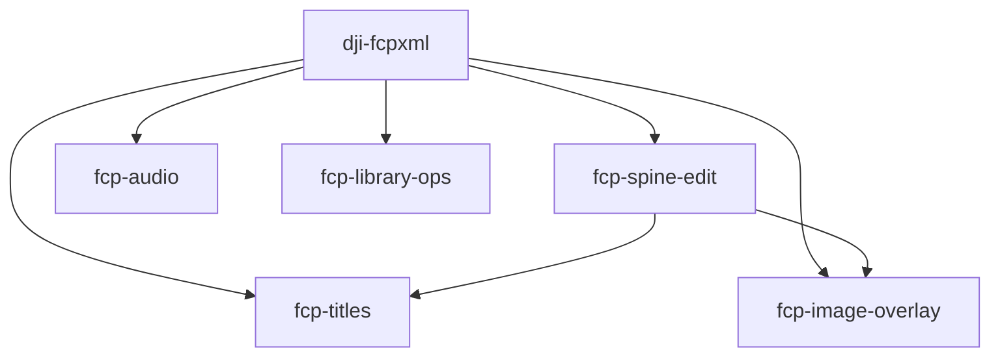

# fcp-six-skills

[](https://github.com/kiwamust/fcp-six-skills/actions/workflows/test.yml)

Final Cut Pro（FCPXML 1.13）を AI エージェントから安全に編集するための **Agent Skills 6本セット**（MIT）。

推測で XML を書くと `invalid edit` やフレーム境界エラーで何時間も溶ける、という実戦教訓をプロトコル化したもの。対象は主に **DJI Osmo Pocket 3（29.97fps / drop-frame）** だが、FCPXML の一般ルール（audio lane、title、library 運用）も含む。

**OSS としての位置づけ**: 旅行 Vlog 等の企画スキルとは分離し、**FCPXML 実装だけ**を再利用可能に保つ。企画・納品フェーズを足す方法は [docs/optional-domain-workflow.md](docs/optional-domain-workflow.md)。

## クイックスタート

```bash
git clone https://github.com/kiwamust/fcp-six-skills.git
cd fcp-six-skills
chmod +x scripts/install.sh
./scripts/install.sh claude    # ~/.claude/skills へ symlink
# またはプロジェクト内:
./scripts/install.sh cursor    # ./.cursor/skills へ symlink
```

## 含まれるスキル

| スキル                                           | 役割                                                              |
| ------------------------------------------------ | ----------------------------------------------------------------- |
| [`dji-fcpxml`](skills/dji-fcpxml/)               | 基盤。ffprobe 測定、29.97 整合、`.fcpxmld` 運用、プリフライト     |
| [`fcp-spine-edit`](skills/fcp-spine-edit/)       | spine の尺・offset 一括編集、idempotent rebuild、projection-ready |
| [`fcp-audio`](skills/fcp-audio/)                 | BGM / ENV / SE、lane=-1、fade・音量・Channel EQ                   |
| [`fcp-titles`](skills/fcp-titles/)               | 字幕・テロップ（Basic Title / Typewriter 等）                     |
| [`fcp-image-overlay`](skills/fcp-image-overlay/) | PNG/SVG グラフィック、シネマ帯、ロケーションカード                |
| [`fcp-library-ops`](skills/fcp-library-ops/)     | library 運用、Copy to library、import 前 xmllint ゲート           |

### 依存関係（読む順）



**原則**: 迷ったら FCP で一度組んで **Export XML（FCPXML 1.13）** し、`.fcpxmld/Info.fcpxml` を正とする。手書き単体 `.fcpxml` のみで進めない。

## 前提ツール

| ツール         | 用途                                              |
| -------------- | ------------------------------------------------- |
| Final Cut Pro  | import / export / 実機検証                        |
| `ffprobe`      | DJI MP4 の fps・TC・duration 測定                 |
| `xmllint`      | import 前 DTD valid チェック（`fcp-library-ops`） |
| `rsvg-convert` | SVG → PNG（`fcp-image-overlay`、任意）            |
| Python 3.11+   | `dji-fcpxml/scripts/` の補助スクリプト            |

## テスト

```bash
cd skills/dji-fcpxml && python3 tests/test_rewrite.py
```

## 貢献

[CONTRIBUTING.md](CONTRIBUTING.md) — 個人プロジェクト固有のパスは PR に含めない。

## ライセンス

MIT — [LICENSE](LICENSE)
