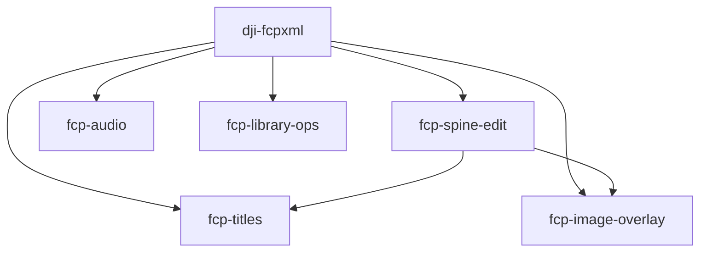

# fcp-six-skills

Final Cut Pro（FCPXML 1.13）を AI エージェントから安全に編集するための **Agent Skills 6本セット**。

推測で XML を書くと `invalid edit` やフレーム境界エラーで何時間も溶ける、という実戦教訓をプロトコル化したもの。対象は主に **DJI Osmo Pocket 3（29.97fps / drop-frame）** だが、FCPXML の一般ルール（audio lane、title、library 運用）も含む。

## 含まれるスキル

| スキル | 役割 |
| --- | --- |
| [`dji-fcpxml`](skills/dji-fcpxml/) | 基盤。ffprobe 測定、29.97 整合、`.fcpxmld` 運用、プリフライト |
| [`fcp-spine-edit`](skills/fcp-spine-edit/) | spine の尺・offset 一括編集、idempotent rebuild、projection-ready |
| [`fcp-audio`](skills/fcp-audio/) | BGM / ENV / SE、lane=-1、fade・音量・Channel EQ |
| [`fcp-titles`](skills/fcp-titles/) | 字幕・テロップ（Basic Title / Typewriter 等） |
| [`fcp-image-overlay`](skills/fcp-image-overlay/) | PNG/SVG グラフィック、シネマ帯、ロケーションカード |
| [`fcp-library-ops`](skills/fcp-library-ops/) | library 運用、Copy to library、import 前 xmllint ゲート |

### 依存関係（読む順）



**原則**: 迷ったら FCP で一度組んで **Export XML（FCPXML 1.13）** し、`.fcpxmld/Info.fcpxml` を正とする。手書き単体 `.fcpxml` のみで進めない。

## インストール

### Claude Code

リポジトリを clone したあと、各スキルを `~/.claude/skills/` にコピー（または symlink）する。

```bash
git clone https://github.com/kiwamust/fcp-six-skills.git
cd fcp-six-skills
for s in skills/*/; do
  ln -sfn "$(pwd)/$s" "$HOME/.claude/skills/$(basename "$s")"
done
```

### Cursor

プロジェクト単位で使う場合:

```bash
mkdir -p .cursor/skills
for s in /path/to/fcp-six-skills/skills/*/; do
  ln -sfn "$s" ".cursor/skills/$(basename "$s")"
done
```

グローバルに置く運用は Claude Code と同様（Cursor の User Rules / skills 設定に合わせてパスを調整）。

## 前提ツール

| ツール | 用途 |
| --- | --- |
| Final Cut Pro | import / export / 実機検証 |
| `ffprobe` | DJI MP4 の fps・TC・duration 測定 |
| `xmllint` | import 前 DTD valid チェック（`fcp-library-ops`） |
| `rsvg-convert` | SVG → PNG（`fcp-image-overlay`、任意） |
| Python 3.11+ | `dji-fcpxml/scripts/` の補助スクリプト |

## テスト

`dji-fcpxml` の文字列変換ロジック（ffprobe 非依存）:

```bash
cd skills/dji-fcpxml
python3 tests/test_rewrite.py
```

## 関連

- 上位の Vlog ワークフロー用スキル（別管理）: `travelVlog`
- 本リポジトリは **FCPXML 実装プロトコル** に特化。素材パック（SVG 挿入カット等）は別プロジェクトで管理してよい

## ライセンス

MIT — 詳細は [LICENSE](LICENSE)。
